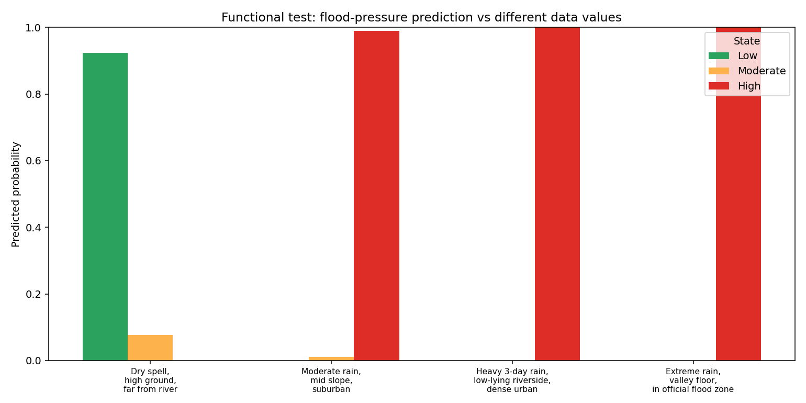
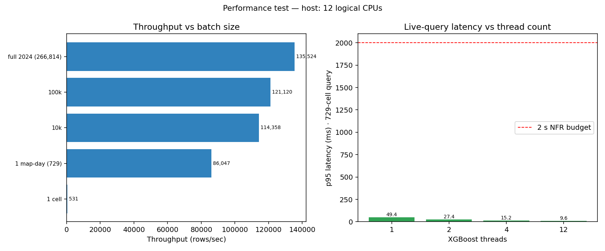
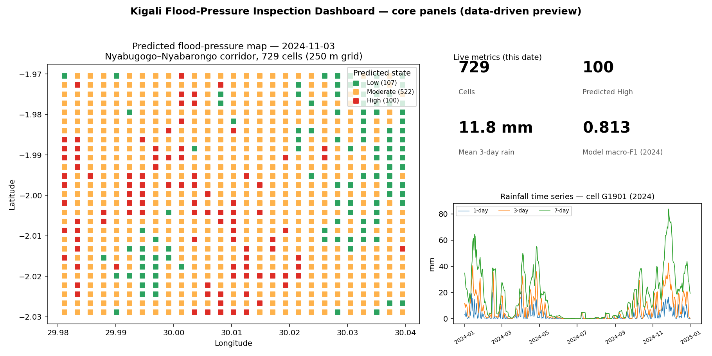
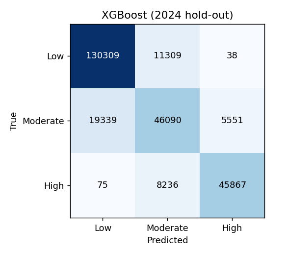
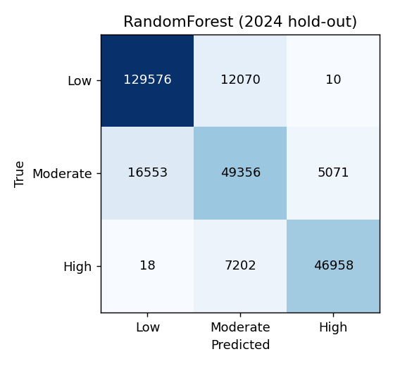
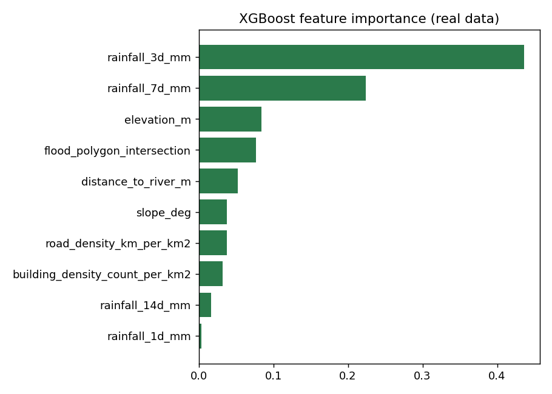
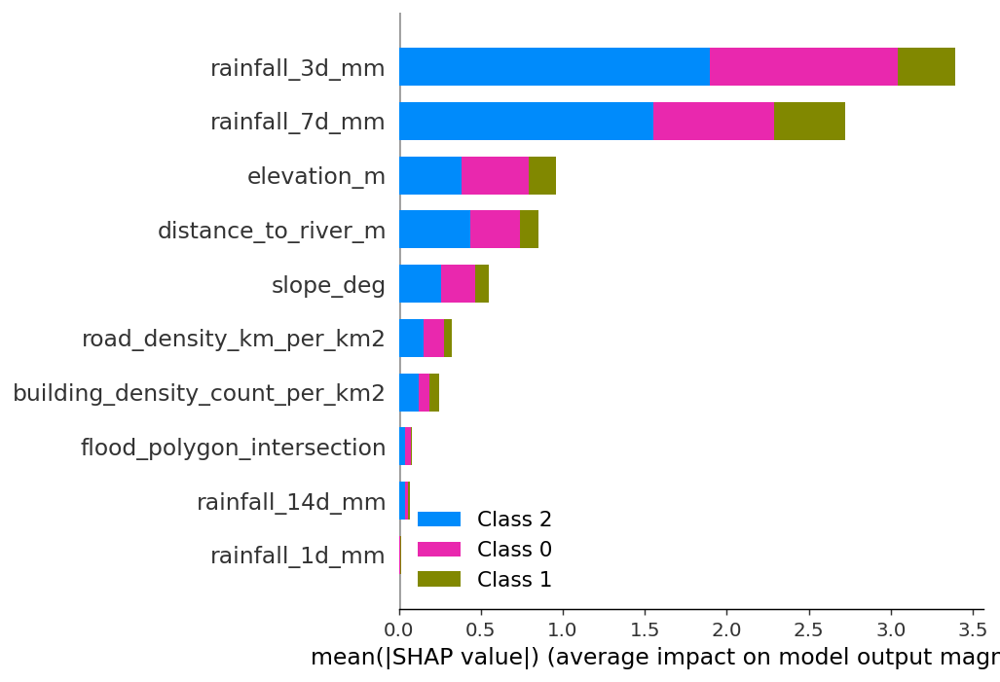
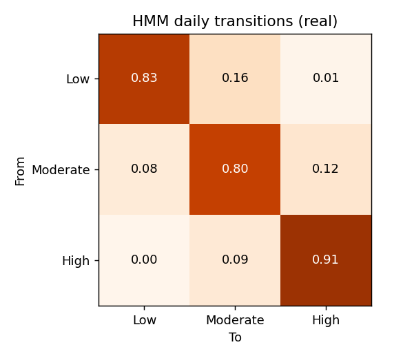
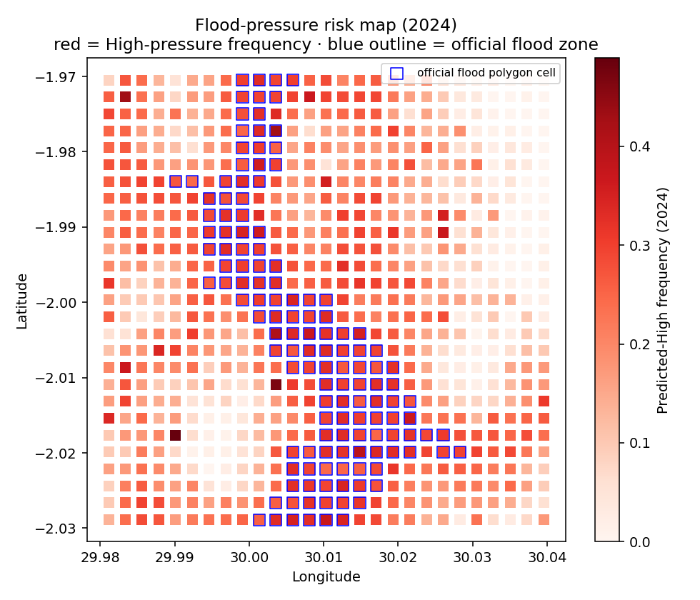

# Testing Results

**Project:** Geospatial Flood-Risk Modelling (Climate Data + HMM), Kigali corridor
**Author:** Kellen Murerwa · **Supervisor:** Emmanuel Adjei

Every number and screenshot below is produced by the scripts in
[`../tests/`](../tests/) against the **real** dataset and the **deployed** XGBoost
model — nothing here is hand-typed. Re-run everything with:

```bash
python -m pytest "Capstone final project/tests/test_pipeline.py" -v
python "Capstone final project/tests/demo_data_values.py"
python "Capstone final project/tests/benchmark_performance.py"
python "Capstone final project/tests/make_dashboard_preview.py"
```

The three rubric strands map to three testing strategies:

| Rubric requirement | Strategy | Artefact |
|---|---|---|
| Functionality under different **testing strategies** | Unit + integration (pytest) | `test_output_pytest.txt` |
| Functionality with different **data values** | Scenario sweep | `test_output_data_values.txt`, `screenshots/demo_data_values.png` |
| Performance on different **hardware/software specs** | Latency/throughput benchmark | `test_output_performance.txt`, `screenshots/benchmark_performance.png` |

---

## 1. Testing strategy A — unit & integration tests (pytest)

10 automated tests covering artefact loading, the feature schema, dataset
integrity (no NaNs, valid label space), prediction shape/range, probability
calibration, and **reproduction of the headline 2024 hold-out metrics**.

```
============================= test session starts =============================
collected 10 items
test_model_artefacts_exist ............................... PASSED
test_model_feature_schema ................................ PASSED
test_dataset_shape ....................................... PASSED
test_no_nan_in_features .................................. PASSED
test_label_space_is_valid ................................ PASSED
test_prediction_shape_and_range .......................... PASSED
test_predict_proba_is_calibrated ......................... PASSED
test_2024_holdout_reproduces_headline_metrics ............ PASSED
test_summary_targets_consistent .......................... PASSED
test_spatial_enrichment_above_one ........................ PASSED
============================= 10 passed in 9.23s ==============================
```

Full log: [`test_output_pytest.txt`](test_output_pytest.txt). The integration test
independently re-computes macro-F1 = 0.813 and high-recall = 0.843 on the 2024
test hold-out, confirming the published `results_summary.json` is reproducible.

---

## 2. Testing strategy B — functionality with different data values

Four scenarios sweep rainfall, elevation, distance-to-river and urban density:



| Scenario | P(Low/Mod/High) | Predicted |
|---|---|---|
| Dry spell, high ground, far from river | 0.92 / 0.08 / 0.00 | **Low** |
| Moderate rain, mid slope, suburban | 0.00 / 0.01 / 0.99 | **High** |
| Heavy 3-day rain, low-lying riverside, dense urban | 0.00 / 0.00 / 1.00 | **High** |
| Extreme rain, valley floor, in official flood zone | 0.00 / 0.00 / 1.00 | **High** |

The product responds correctly to inputs: a dry, elevated, far-from-river cell is
**Low**; rising rainfall/exposure drives **P(High)** monotonically upward
(verified to a 1e-3 tolerance at saturation). Full log:
[`test_output_data_values.txt`](test_output_data_values.txt).

> Observation carried into the analysis: the boundary is sharp — even *moderate*
> sustained rain saturates to P(High)≈0.99. This favours recall (the design goal)
> but compresses the Moderate band; calibration is listed as future work.

---

## 3. Testing strategy C — performance on different specifications

Benchmarked on a 12-logical-core host across batch sizes and **thread counts**
(emulating constrained vs. multi-core software configurations):



**Live single query (1 date = 729 cells):**

| Threads (config) | mean | p95 | vs 2 s budget |
|---|---|---|---|
| 1 (constrained) | 45.7 ms | 49.4 ms | ✅ ~40× margin |
| 4 | 13.3 ms | 15.2 ms | ✅ |
| 12 (full) | 8.3 ms | **9.6 ms** | ✅ ~200× margin |

Bulk throughput scales to ~120k–135k cell-predictions/sec. The 2-second NFR
latency budget is **met on every configuration**, including single-thread. Full
log: [`test_output_performance.txt`](test_output_performance.txt).

---

## 4. Deployed-app functionality (dashboard core panels)

Data-driven preview of the live Streamlit app for 2024-11-03 (a balanced day with
all three states present — Low 147 / Moderate 482 / High 100 cells):



The app boots and serves cleanly (HTTP 200 health + main page) — see
[`deploy_local_boot.log`](deploy_local_boot.log) and
[`../deployment/DEPLOYMENT.md`](../deployment/DEPLOYMENT.md).

---

## 5. Model-quality evidence (from the trained pipeline)

| | |
|---|---|
|  |  |
|  |  |
|  |  |

These confirm: rainfall-accumulation features dominate (SHAP/importance), errors
are concentrated on adjacent states (confusion matrices), state persistence is
high (HMM), and predicted High-pressure is enriched inside the official zones
(risk map). Detailed interpretation in [`../analysis/ANALYSIS.md`](../analysis/ANALYSIS.md).
